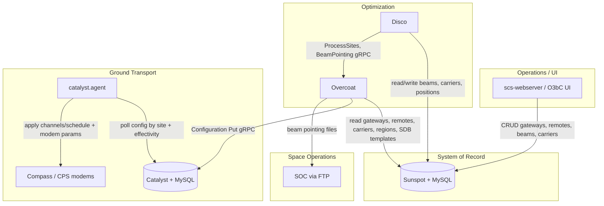
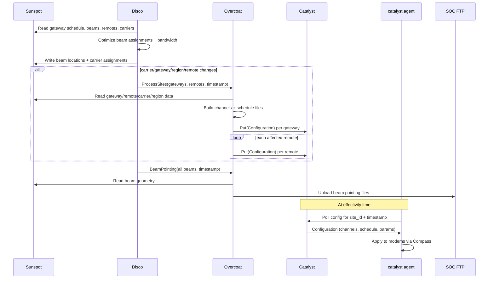

# Disco, Overcoat, Catalyst, Sunspot, and scs-prototype

This document explains how the SCS (Shared Capacity Service) optimization and configuration pipeline fits together: **Sunspot** as the system of record, **Disco** as the capacity optimizer, **Overcoat** as the SDB/config generator, **Catalyst** as the ground configuration broadcaster, and **scs-prototype** as the legacy Python packaging of Disco and Overcoat.

---

## High-level picture

These services implement the **SCS optimization loop**: assign ships to satellite beams, generate modem configuration files, and deliver them to gateway/remote terminals before each satellite handover.

**Data moves in one direction for config delivery:**

1. Operators and other services update **Sunspot**.
2. **Disco** reads Sunspot, optimizes, writes results back to Sunspot.
3. **Disco** tells **Overcoat** which gateways/remotes/beams changed.
4. **Overcoat** reads Sunspot, builds SDB artifacts, pushes them to **Catalyst** (and beam files to SOC).
5. **Catalyst agents** on each site poll Catalyst and apply configuration to modems at the scheduled effectivity time.

---

## Service-by-service functionality

### Sunspot

**Role:** Central configuration and state service — the **system of record** for SCS and ASPM O3b Classic.

**What it does:**
- Exposes a **gRPC Data API** (and REST) backed by **MySQL**.
- Provides CRUD and query operations for operational entities:
  - **Gateways** — ground hub sites (e.g. Lurin `gwlur`), including channel and schedule files.
  - **Remotes** — ship/terminal sites (dynamic SCS terminals).
  - **Beams** — satellite beam geometry, frequency, polarization, region assignment.
  - **Beam groups** — service zones (e.g. CARIBBEAN).
  - **Beam overrides** — manual beam assignment constraints.
  - **Carriers / carrier assignments** — SCPC bandwidth assignments per remote/beam.
  - **Regions** — satellite coverage regions and region schedule templates.
  - **Modems**, switches, and related metadata.
- Tracks **dirty flags** on gateways, regions, and remotes when UI or other services mark data as needing reconfiguration.
- Maintains **history** of changes for audit and troubleshooting.
- Consumes **Kafka** events for operational telemetry (used by other SCS/ASPM components).

**Who talks to Sunspot:**

| Client | Purpose |
|--------|---------|
| scs-webserver / UI | Operator CRUD, manual overrides |
| Disco | Read current state; write optimized beam locations and carrier assignments |
| Overcoat | Read gateway/remote/carrier/region/SDB data to build config files |
| catalyst.agent (GPS poller) | Push terminal GPS positions |
| config-agent, gps-agent | Terminal/gateway agent support |
| live-sim, simulation-worker | Simulation from real or mocked state |
| o3bclassic-data-control | ECM / classic data import |

Sunspot does **not** push config to modems directly. It is the authoritative store that Disco and Overcoat read from.

---

### Disco

**Role:** **Capacity optimizer** for the dynamic MEO maritime system. Assigns ships (remotes) into beams and allocates carrier bandwidth while minimizing disruptive beam changes.

**What it does:**
- Runs on a **handover-aligned loop** — each iteration is timed to the next satellite region handover from the gateway schedule.
- Reads from **Sunspot** (or Sunspot-backed datastore in the Python prototype):
  - Gateway schedule (next handover region/beam/time).
  - Beams, remotes, carriers, beam overrides, beam group constraints.
- Runs optimization:
  - **Bin ships into beams** — cover uncovered sites, respect overrides, minimize beam changes, split congested beams.
  - **Assign carrier bandwidth** — split beam spectrum among remotes.
  - Update beam center locations and carrier assignments.
- **Persists results** back to Sunspot (beam locations, carrier assignments).
- **Triggers Overcoat** when something material changed:
  - Carrier assignment updates.
  - Dirty gateways (manual/UI changes).
  - Dirty regions (new schedule for handover region).
  - Dirty remotes.
- Always sends **beam pointing** updates to Overcoat each iteration (for SOC).

**gRPC calls to Overcoat:**

| RPC | Message | When |
|-----|---------|------|
| `ProcessSites` | `SiteChanges{timestamp, gateways[], remotes[]}` | Carrier/gateway/region/remote changes |
| `BeamPointing` | `BeamChanges{timestamp, beams[]}` | Every iteration — all beams repointed for SOC |

**Implementations:**
- **Production (legacy):** `scs-prototype/scs_disco_daemon_module/disco_daemon_main.py`
- **Go rewrite (in progress):** `disco/` — connects to Sunspot; Overcoat integration marked TODO in `disco/cmd/disco/main.go`

**Simulation:** Disco can run in test mode without Overcoat (`DISABLE_OVERCOAT` or `--test_mode`), writing results only to the database/logs.

---

### Overcoat

**Role:** **SDB channels/schedule generator and configuration publisher.** Translates Sunspot operational state into modem-ready files and pushes them downstream.

**What it does:**

#### 1. Gateway SDB (`ProcessSites` → gateway IDs)
- Loads existing gateway **channels file** from Sunspot.
- Merges in SCS dynamic terminal carrier data (SCPC — one carrier per frequency in a beam).
- Produces updated **channels file** only (gateway schedule rarely changes).
- Sends a **Catalyst Configuration** (channels + modem parameters) for the gateway site.

#### 2. Remote/terminal SDB (`ProcessSites` → remote IDs)
- Only when the remote’s **region changed** (handover):
  - Builds **channels file** from scratch from Sunspot carrier data.
  - Builds **schedule file** from region schedule template in Sunspot.
- Sends per-remote **Catalyst Configuration** (channels + schedule + parameters).

#### 3. Beam pointing (`BeamPointing`)
- Reads beam geometry from Sunspot.
- Writes **SOC beam re-targeting / pointing files**.
- Uploads files to **SOC FTP** servers (production path).
- Does **not** go through Catalyst — space segment is separate from ground modem config.

**Effectivity offsets:** Overcoat applies configurable time offsets (e.g. gateway −15s, remote −15s, region shift −20s) so configs commit on modems slightly before the nominal handover timestamp.

**gRPC dependencies:**

| Direction | Service | Purpose |
|-----------|---------|---------|
| Inbound | Disco | `ProcessSites`, `BeamPointing` |
| Outbound | Sunspot | Read gateways, remotes, carriers, regions, beam data |
| Outbound | Catalyst | `CatalystConfigurationInputService.Put` |

**Implementations:**
- **Production (legacy):** `scs-prototype/scs_overcoat_module/`
- **Go rewrite:** `overcoat/` (“gophercoat”) — same RPC surface, implemented in `overcoat/server/overcoat_service.go`

---

### Catalyst

**Role:** **Ground carrier transport configuration broadcaster.** Stores scheduled modem configurations and serves them to on-site agents at effectivity time.

**What it does:**
- Accepts **Configuration** messages via gRPC `Put`:
  - **Signature** — unique config ID.
  - **Effectivity time** — when config should apply.
  - **Site ID** — gateway or remote site (e.g. `gwlur`, `USA_OAS_001`).
  - **Channel file** — XML SDB channels content.
  - **Schedule file** — XML SDB schedule (remotes only, when region changes).
  - **Parameters** — per-carrier modem settings (TX/RX frequency, rate, power, commit flag).
- Persists to **Catalyst MySQL** (`configurations`, `h_configurations` history).
- Supports **Cancel** for withdrawn configs.
- Exposes agent-facing gRPC (port 50051) for agents to **poll** current/next configuration by site and timestamp.

**Who talks to Catalyst:**

| Client | Purpose |
|--------|---------|
| Overcoat | Push new gateway/remote configurations after Disco iteration |
| catalyst.agent | Poll and apply configs on gateway/remote CPS terminals |
| config-agent | Related ground transport configuration |

Catalyst is the **handoff point** between NOC-generated configs and field modem application. It does not talk to Sunspot directly in the main SCS loop.

---

### Catalyst Agent (related downstream service)

**Role:** On-premise agent at **gateway** or **remote (terminal)** CPS sites.

- **Catalyst poller** — queries Catalyst for configs matching site ID and upcoming effectivity.
- **Modem poller** — applies channel/schedule files and parameters to modems via **Compass**.
- **GPS poller** (terminals) — sends ship position back to **Sunspot** (feeds Disco on next iteration).
- **SDB poller** — monitors local SDB file state vs Compass.

This closes the loop: GPS in Sunspot → Disco optimization → Overcoat → Catalyst → agent → modem.

---

### scs-prototype

**Role:** **Legacy Python monorepo packaging** for early/production SCS services before the Go rewrites.

**Contains:**
- `scs_disco_daemon_module/` — Python Disco daemon (production optimizer).
- `scs_overcoat_module/` — Python Overcoat server (production SDB processor).
- `scs_messages_module/` — Shared **protobuf/gRPC** definitions (`overcoat_api`, `sunspot_api`, `catalyst` messages).
- `scs_common_module/` — Logging, gRPC helpers, auth interceptors, JSON config.
- `scs_datastore_module/` — Sunspot gRPC client abstraction.
- `_resources/config/` — Example `disco_config.json`, `overcoat_config.json`.
- `_resources/docs/` — Architecture docs mirrored in standalone Go repos.

**Relationship to Go services:**

| scs-prototype (Python) | Go replacement | Status |
|------------------------|----------------|--------|
| `disco_daemon_main.py` | `disco/` | Go version in development |
| `overcoat_daemon_main.py` | `overcoat/` | Go version available (“gophercoat”) |
| Shared protos | Copied/generated in each Go module | Same wire protocol |

Operators typically deploy **one** Disco and **one** Overcoat implementation, not both. The protobuf APIs are shared so Disco (Python) can call Overcoat (Go) or vice versa.

---

## End-to-end flow (one Disco iteration)

### Trigger conditions for Overcoat `ProcessSites`

From `scs-prototype/scs_disco_daemon_module/disco_daemon_main.py`:

Overcoat is triggered when **any** of:
1. Carrier assignments changed this iteration.
2. One or more gateways are marked **dirty** (e.g. UI edit).
3. One or more **handover regions** are dirty (schedule update).
4. One or more remotes are **dirty**.

`BeamPointing` runs **every iteration** regardless, so SOC always receives updated beam coordinates.

---

## Configuration and ports (typical NOC)

| Service | Default gRPC port | Notes |
|---------|-------------------|-------|
| Sunspot | 40041 | Data API |
| Overcoat | 60061 | Disco calls in |
| Catalyst (input) | 50052 | Overcoat `Put` |
| Catalyst (agent) | 50051 | catalyst.agent polls |

TLS + client certificates are used between all NOC services in production configs under `scs-prototype/_resources/config/`.

---

## How this fits in the wider OCS architecture

From `architecture.md`:

- **Sunspot** is the core system-of-record for **SCS and ASPM**.
- **Disco** optimizes beams and capacity; **Overcoat** generates SDB outputs; together they publish to **SOC** (beam pointing) and **Catalyst** (modem config).
- **scs-webserver** and UI read/write Sunspot for operator workflows.
- **simulation-worker** can spin up Sunspot/Disco images for offline testing.

The optimization pipeline is one domain within the larger OCS workspace (ASPM power management, Follow-the-Ship, simulation, etc.), but Sunspot is the hub that ties SCS planning, optimization, and configuration delivery together.

---

## Summary table

| Service | Primary function | Reads from | Writes to |
|---------|------------------|------------|-----------|
| **Sunspot** | Operational data warehouse | UI, agents, Kafka | MySQL; serves all SCS consumers |
| **Disco** | Beam + bandwidth optimizer | Sunspot | Sunspot; triggers Overcoat |
| **Overcoat** | SDB file builder + publisher | Sunspot | Catalyst (configs), SOC FTP (beams) |
| **Catalyst** | Config schedule store + broadcaster | Overcoat | MySQL; serves agents |
| **catalyst.agent** | On-site modem configurator | Catalyst | Compass modems; GPS → Sunspot |
| **scs-prototype** | Legacy Python packaging | — | Hosts production Disco + Overcoat modules and shared protos |
