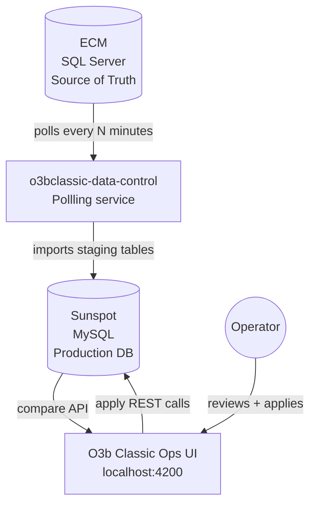
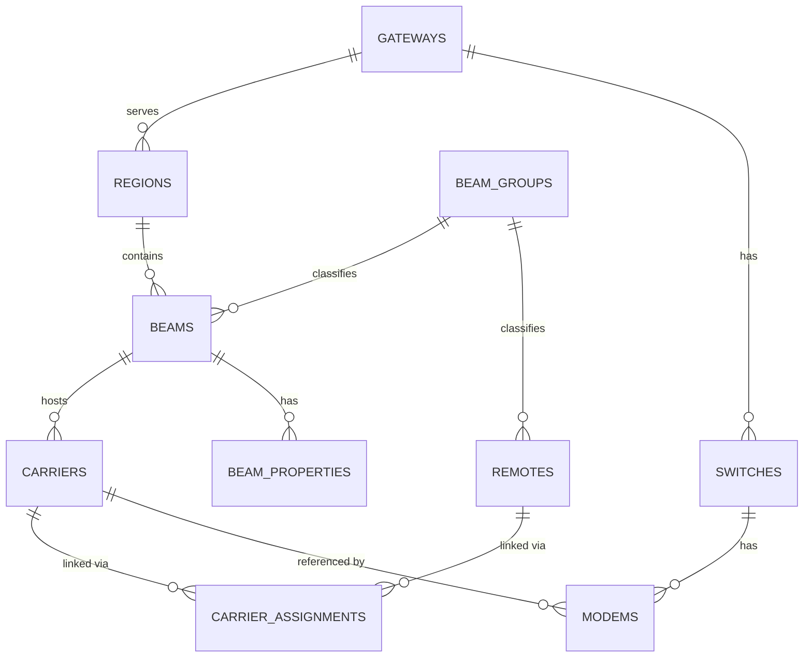
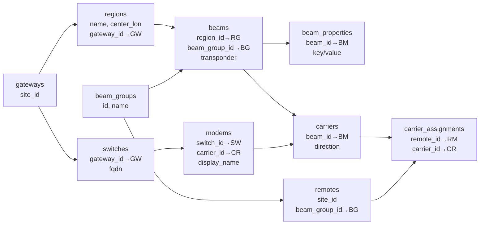
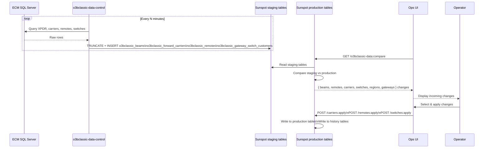
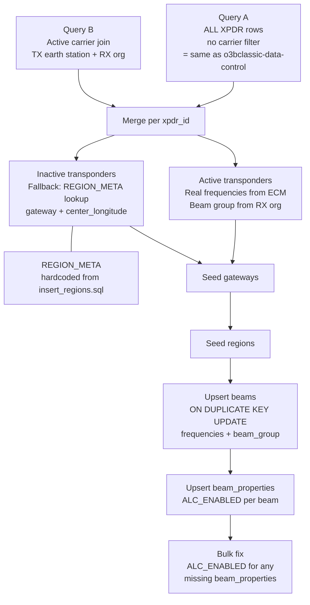
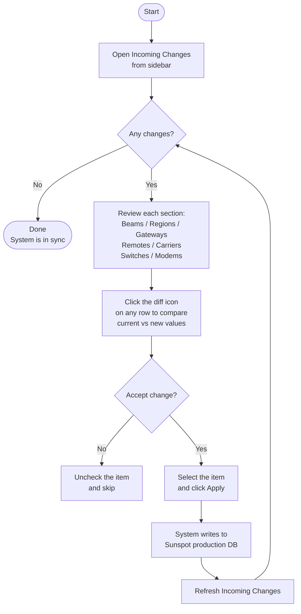
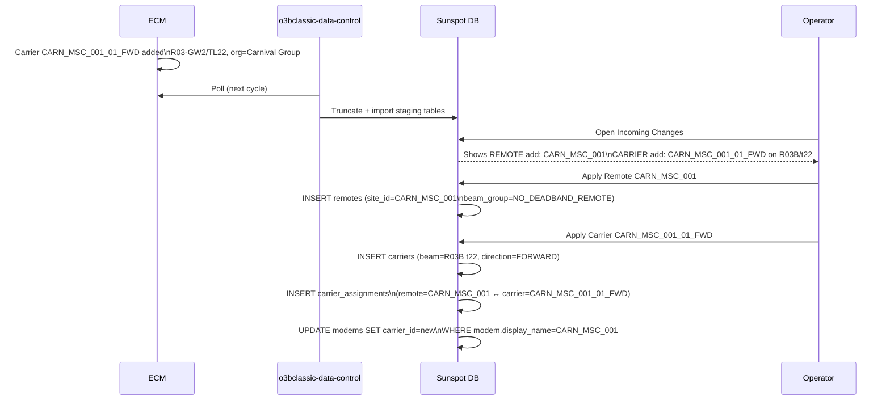

# O3B Classic Operations — Operator Guide

> **Audience**: Operations staff (including newcomers) who manage the O3B Classic satellite system using the O3b Classic Ops UI and the `scs-db-migrate` scripts.  
> **Scope**: Entity model, UI operations, ECM data flow, `sync_ecm_to_sunspot.py`, and end-to-end worked examples.

---

## Table of Contents

1. [System Overview](#1-system-overview)
2. [Entity Model & Relationships](#2-entity-model--relationships)
3. [Database Schema Summary](#3-database-schema-summary)
4. [ECM — The Source of Truth](#4-ecm--the-source-of-truth)
5. [How Data Flows: ECM → Sunspot → UI](#5-how-data-flows-ecm--sunspot--ui)
6. [sync_ecm_to_sunspot.py — Developer Script](#6-sync_ecm_to_sunspotpy--developer-script)
7. [Incoming Changes Workflow](#7-incoming-changes-workflow)
8. [UI Operations Reference](#8-ui-operations-reference)
9. [End-to-End Examples](#9-end-to-end-examples)
10. [Troubleshooting](#10-troubleshooting)

---

## 1. System Overview

O3B Classic is a Low Earth Orbit satellite system. The ops platform manages:

- Which **gateways** (ground stations) serve which **regions** (geographic coverage zones)
- Which **beams** (transponder slots) carry traffic in each region
- Which **remotes** (customer terminals) are assigned to which beams
- Which **carriers** (frequency channels) connect remotes to gateways
- Which **switches** and **modems** track physical modem hardware at each gateway



**Key principle:** ECM is always the master. The UI is a controlled gate — the operator reviews ECM changes and decides when to apply them to Sunspot (production).

---

## 2. Entity Model & Relationships

### 2.1 Hierarchy



### 2.2 Entity Descriptions

#### Gateway
The **physical ground station** (teleport) that connects the satellite to the internet.

| Field | Meaning |
|-------|---------|
| `site_id` | Short code, e.g. `gwvrn` (Versailles), `gwlur` (Lurin, Peru) |
| `name` | Human name, e.g. `GW VRN` |
| `latitude`, `longitude` | Geographic position |
| `channel_file`, `schedule_file` | Uplink schedule configuration files |

> A gateway cannot be deleted if regions reference it.

---

#### Region
A **geographic coverage zone** of the O3B satellite over which it transmits a set of beams.

| Field | Meaning |
|-------|---------|
| `name` | e.g. `R01A`, `R01B` … `R14B` — always `R<NN><A or B>` |
| `center_longitude` | Center of the beam footprint (degrees) |
| `gateway_id` → `gateways` | Which gateway manages this region |
| `schedule_file` | Scheduling data for this region |

**A vs B suffix**: The O3B satellite has two polarisations per orbital slot.  
- **A** (`R01A`, `R02A` …) = right-hand circular polarisation (RHCP) — transponders 11–15  
- **B** (`R01B`, `R02B` …) = left-hand circular polarisation (LHCP) — transponders 21–25

> Regions are **fixed by the satellite design**. There are exactly 28 (R01A–R14B).  
> They are seeded at system startup and do not change unless a new satellite is launched.

---

#### Beam
A **transponder slot** within a region. Each beam carries forward (downlink) and return (uplink) carriers.

| Field | Meaning |
|-------|---------|
| `transponder` | 2-char number: `11`–`15` (A-side) or `21`–`25` (B-side) |
| `region_id` → `regions` | Which region this beam belongs to |
| `beam_group_id` | `1` = NOT_SCS, `2` = CARIBBEAN (see below) |
| `forward_downlink_cf_mhz` | Forward link center frequency |
| `forward_bw_mhz` | Bandwidth in MHz |
| `gateway_pol` / `remote_pol` | RHCP or LHCP polarisation |
| `p2mp_rolloff_perc` | Rolloff factor for P2MP carriers |
| `half_beamwidth_deg` | Physical beam width (typically 2.5°) |

**Beam Groups:**

| ID | Name | Meaning |
|----|------|---------|
| 1 | `NOT_SCS` | Non-SES customer remotes (Carnival, Digicel, etc.) — included in ECM compare |
| 2 | `CARIBBEAN` | SCS-managed SES remotes — **skipped** in ECM compare (managed separately) |

> CARIBBEAN beams are fully managed through internal SCS tooling, not through this UI.

---

#### Remote
A **customer earth terminal** (dish/modem at a ship, oil platform, land site, etc.).

| Field | Meaning |
|-------|---------|
| `site_id` | ECM identifier, e.g. `MAR_SVW_001` |
| `name` | Display name |
| `beam_group_id` | Must match its beam's beam_group |
| `forward_scpc_bw_msps` | Allocated forward bandwidth |
| `return_scpc_bw_msps` | Allocated return bandwidth |
| `forward_cir_mbps` / `return_cir_mbps` | Committed Information Rate |
| `antenna_type` | e.g. `INTELLIAN_REVGO_MPOW_LNB` |
| `modem_type` | e.g. `VIASAT_MODEM`, `GILAT_MODEM` |
| `is_diversity` | Property: site has two antennas for diversity |
| `is_p2mp` | Property: site uses Point-to-MultiPoint carrier |

---

#### Carrier
A **frequency channel** on a beam, carrying traffic in one direction.

| Field | Meaning |
|-------|---------|
| `beam_id` → `beams` | Which beam this carrier is on |
| `direction` | `FORWARD` (gateway→remote) or `RETURN` (remote→gateway) |
| `display_name` | ECM carrier name, e.g. `MAR_SVW_001_01_FWD` |
| `uplink_cf_mhz` | Uplink center frequency |
| `downlink_cf_mhz` | Downlink center frequency |
| `symbol_rate_msps` | Symbol rate (bandwidth) |
| `rolloff_perc` | Rolloff factor |
| `point_to_multipoint` | P2MP flag |
| `source` | `ECM` (imported) or `SCS` (manually created) |

Carriers are linked to remotes via `carrier_assignments`:

```
carrier_assignments
  remote_id  → remotes
  carrier_id → carriers
  timestamp_assigned  (Unix time)
  timestamp_removed   (Unix time, 0 if current)
```

---

#### Switch
A **network switch at a gateway** that the SNMP modem poller reads.

| Field | Meaning |
|-------|---------|
| `fqdn` | Fully Qualified Domain Name, e.g. `vcsw1otn.vrn.o3b.local` |
| `ip_address` | Management IP |
| `port` | SNMP port (usually 161) |
| `gateway_id` → `gateways` | Which gateway this switch belongs to |

---

#### Modem
A **logical modem record** associated with a switch port.

| Field | Meaning |
|-------|---------|
| `display_name` | Label on the switch, e.g. `MAR_SVW_001` |
| `oid_suffix` | SNMP OID suffix to read modem data |
| `switch_id` → `switches` | Which switch |
| `carrier_id` → `carriers` (nullable) | Which carrier this modem currently uses |
| `modem_type` | Hardware type |

> For **diversity sites**, `carrier_id` is NULL — the operator must assign the carrier manually.

---

## 3. Database Schema Summary



**Key constraint**: You cannot add a region without its gateway, a beam without its region, or a carrier without its beam. The dependency chain is:

```
Gateway → Region → Beam → Carrier → Remote (via carrier_assignment)
Gateway → Switch → Modem → Carrier
```

---

## 4. ECM — The Source of Truth

**ECM** (Engineering Configuration Management) is the SES SQL Server database that holds the authoritative record of all carrier plans.

### 4.1 Key ECM Tables

| ECM Table | Sunspot Equivalent | Role |
|-----------|-------------------|------|
| `XPDR` | `beams` | Transponder slots; `xpdr_id` = region+transponder identifier |
| `ECM_CARRIER` + `ECM_CARRIER_SEGMENT` | `carriers` | Carrier definitions with validity windows |
| `ECM_EARTH_STATION` (TX side) | `gateways` | Ground stations (gateways) |
| `ECM_EARTH_STATION` (RX side) | `remotes` | Customer terminals |
| `ECM_ORGANIZATION` | remote `properties` | Customer company details |
| `ECM_CARRIER_EARTH_STATION_ASSOC` | `carrier_assignments` | Which remote is on which carrier |

### 4.2 ECM XPDR ID Format

ECM identifies transponders with IDs like:

```
R09-GW1/TL14    →  Region 9, Gateway 1 (A-side), Transponder Line 14
                   Parsed as: region=R09A, transponder=14

R03-GW2/TL23    →  Region 3, Gateway 2 (B-side), Transponder Line 23
                   Parsed as: region=R03B, transponder=23
```

Rules:
- `GW1` / `TL11`–`TL15` → A-side region (RHCP, transponders 11–15)
- `GW2` / `TL21`–`TL25` → B-side region (LHCP, transponders 21–25)

### 4.3 ECM Carrier Status

Only two statuses are imported:
- `ACTIVATED` — carrier is live
- `SCHEDULED_FOR_DEACTIVATION` — carrier is ending soon, still treated as active

`DEACTIVATED`, `PLANNED`, etc. are ignored.

### 4.4 Beam Group Derivation

The system determines `beam_group_id` from who is using the carrier (RX earth station owner):

```
IF all RX organisations = "O3b" or "O3B"  → beam_group_id = 2 (CARIBBEAN)
IF any RX organisation = other customer    → beam_group_id = 1 (NOT_SCS)
```

---

## 5. How Data Flows: ECM → Sunspot → UI



### Staging Tables (Temporary Import)

These are completely **replaced on every poll** by `o3bclassic-data-control`:

| Staging Table | Contains |
|--------------|---------|
| `o3bclassic_beams` | All XPDR entries regardless of carrier status |
| `o3bclassic_forward_carriers` | Active carriers (ACTIVATED/SCHEDULED) |
| `o3bclassic_remotes` | Remote sites with BW/CIR |
| `o3bclassic_gateway_switch_customers` | Switch/modem assignments per gateway |

### Production Tables (Applied)

Only modified when the operator explicitly applies changes:

`gateways`, `regions`, `beams`, `carriers`, `carrier_assignments`, `remotes`, `switches`, `modems`, `beam_properties`

---

## 6. sync_ecm_to_sunspot.py — Developer Script

> **IMPORTANT**: This script is a **developer/deployment tool**, not an operator tool. In production, operators manually add gateways, regions, and beams through the UI. This script is used to bootstrap a fresh environment quickly.

### 6.1 What It Does



### 6.2 Why REGION_META Exists

`o3bclassic-data-control` uses:
```sql
SELECT DISTINCT xpdr_id, alc_flg FROM XPDR   -- no carrier filter
```

So transponders **with no active carriers** (e.g. R01A, R09A) are still compared against Sunspot. Sunspot must have those beams or they appear as "incoming changes". 

For inactive transponders, ECM has no earth station (no carrier → no TX association → no gateway name). The script uses `REGION_META` — a hardcoded copy of `sunspot/assets/scripts/insert_regions.sql` — to provide the gateway and `center_longitude` for those regions.

### 6.3 Running the Script

```bash
# Preview — no database writes
python sync_ecm_to_sunspot.py --dry-run

# Apply all changes
python sync_ecm_to_sunspot.py
```

**Required `.env` keys:**
```ini
# ECM source
SOURCE_SQLSERVER_HOST=lubtzecm01.gad.ses.com
SOURCE_SQLSERVER_PORT=1433
SOURCE_SQLSERVER_USER=your_user
SOURCE_SQLSERVER_PASSWORD=your_password
SOURCE_SQLSERVER_DATABASE=ECMDB_C10
PM_SCHEMA=objown

# Sunspot target
TARGET_SUNSPOT_DB_HOST=10.57.25.10
TARGET_SUNSPOT_DB_PORT=3306
TARGET_SUNSPOT_DB_NAME=sunspot
TARGET_SUNSPOT_DB_USER=root
TARGET_SUNSPOT_DB_PASS=rootpassword

# Extra gateway codes not in the default list
GATEWAY_EXTRA_CODES=SKA:gwska,JED:gwjed
```

### 6.4 Production vs Script: Who Does What

| Task | Production Operator | Script (`sync_ecm_to_sunspot.py`) |
|------|--------------------|---------------------------------|
| Add gateways | UI → manually | Automatic from ECM + REGION_META |
| Add regions | UI → manually | Automatic from REGION_META |
| Add beams | UI → manually | Automatic from ECM XPDR |
| Apply carriers | UI → Incoming Changes → Apply | Not done by script |
| Apply remotes | UI → Incoming Changes → Apply | Not done by script |
| Apply switches/modems | UI → Incoming Changes → Apply | Not done by script |

---

## 7. Incoming Changes Workflow

This is the **core operator workflow** used daily in production.



### 7.1 What Each Section Shows

#### Beams Changes
- Shows beams whose `ALC_ENABLED` property or transponder assignment changed in ECM
- **Add**: New transponder in ECM not yet in Sunspot → must be added manually first (see §8.3)
- **Update**: Beam's `ALC_ENABLED` flag changed in ECM XPDR

> Beams **cannot be added or deleted** through Incoming Changes. They are seeded by the operator manually or via `sync_ecm_to_sunspot.py`.

#### Region Changes
- ECM does not control region definitions
- A region appearing here means it exists in XPDR but Sunspot has no matching region
- **Fix**: Add the region manually in the UI (§8.2) or run `sync_ecm_to_sunspot.py`

#### Gateway Changes
- Shows gateways referenced by ECM carriers that don't exist in Sunspot
- **Fix**: Add the gateway manually (§8.1) or run `sync_ecm_to_sunspot.py`

#### Remote Changes
- **Add**: New remote site found in ECM that isn't in Sunspot yet
- **Update**: Remote's BW, CIR, coordinates, or diversity status changed
- **Delete**: Remote no longer in ECM (carrier deactivated, site off-boarded)

#### Carrier Changes
- **Add**: New carrier in ECM — includes forward and return pair + remote assignments
- **Update**: Carrier frequency, symbol rate, or remote assignment changed
- **Delete**: Carrier deactivated in ECM

> When a carrier's remote assignment changes, modems are automatically updated for non-diversity sites.

#### Switch / Modem Changes
- Reflects what the gateway switch SNMP poller discovered
- **Add**: New switch or modem hardware detected
- **Update**: Switch IP/port changed, modem carrier changed

---

## 8. UI Operations Reference

> URL: `http://<host>/o3b-classic-ops`  
> Default credentials: username `sstark`, password `root123` (development only)

### 8.1 Adding a Gateway

Gateways must be added **before** regions can reference them.

1. Navigate to **O3b Classic Ops → Gateways**
2. Click **＋** (add icon, top right)
3. Fill in:
   - **Site ID**: Short code, format `gw<3 letters>` e.g. `gwvrn`
   - **Name**: Human name e.g. `GW VRN`
   - **Latitude / Longitude**: Geographic coordinates
4. Click **Save**

**Example — Versailles Gateway:**
```
Site ID:   gwvrn
Name:      GW VRN
Latitude:  48.8014
Longitude: 2.1301
```

---

### 8.2 Adding a Region

Regions must be added **before** beams can reference them.

1. Navigate to **O3b Classic Ops → Regions**
2. Click **＋**
3. Fill in:
   - **Name**: `R<NN><A or B>` e.g. `R01A`
   - **Center Longitude**: From the reference table below
   - **Gateway**: Select from dropdown (must exist first)
4. Click **Save**

**Region Reference Table (from insert_regions.sql):**

| Region | Center Lon | Gateway |
|--------|-----------|---------|
| R01A | 227.0 | gwvrn |
| R01B | 241.0 | gwvrn |
| R02A | 252.5 | gwvrn |
| R02B | 267.5 | gwvrn |
| R03A | 278.0 | gwlur |
| R03B | 293.0 | gwlur |
| R04A | 303.5 | gwlur |
| R04B | 318.5 | gwhtl |
| R05A | 329.0 | gwsin |
| R05B | 344.0 | gwsin |
| R06A | 354.5 | gwsin |
| R06B | 9.5 | gwsin |
| R07A | 20.0 | gwsin |
| R07B | 35.0 | gwska |
| R08A | 45.5 | gwnma |
| R08B | 60.5 | gwjed |
| R09A | 71.0 | gwhkb |
| R09B | 86.0 | gwper |
| R10A | 96.5 | gwper |
| R10B | 111.5 | gwper |
| R11A | 122.0 | gwper |
| R11B | 137.0 | gwdub |
| R12A | 147.5 | gwdub |
| R12B | 162.5 | gwdub |
| R13A | 173.0 | gwdub |
| R13B | 188.0 | gwsun |
| R14A | 198.5 | gwsun |
| R14B | 213.5 | gwsun |

---

### 8.3 Adding a Beam

Beams must be added **before** carriers can reference them.

1. Navigate to **O3b Classic Ops → Beams**
2. Click **＋**
3. Fill in:
   - **Region**: Select from dropdown
   - **Transponder**: 2-digit number (11–15 for A regions, 21–25 for B regions)
   - **Beam Group**: `CARIBBEAN` or `NOT_SCS`
   - **Forward Downlink Center Frequency (MHz)**: From beam reference below
   - **Forward Bandwidth (MHz)**: From beam reference below
   - **Return Downlink CF** / **Return BW**: Usually same as forward for O3B Classic
   - **Gateway Polarization**: RHCP for A-side, LHCP for B-side
   - **Remote Polarization**: Opposite of gateway
   - **ALC Enabled**: Usually `true`
4. Click **Save**

**Beam Frequency Reference (from ECM XPDR):**

| Transponder | Approx. Forward CF (MHz) | BW (MHz) | GW Pol | Remote Pol |
|-------------|-------------------------|---------|--------|-----------|
| 11 | ~17960 | ~260 | RHCP | LHCP |
| 12 | ~18220 | ~260 | RHCP | LHCP |
| 13 | ~18490 | ~260 | RHCP | LHCP |
| 14 | ~18920 | ~237 | RHCP | LHCP |
| 15 | ~19157 | ~237 | RHCP | LHCP |
| 21 | ~17960 | ~260 | LHCP | RHCP |
| 22 | ~18220 | ~260 | LHCP | RHCP |
| 23 | ~18490 | ~260 | LHCP | RHCP |
| 24 | ~18920 | ~237 | LHCP | RHCP |
| 25 | ~19157 | ~237 | LHCP | RHCP |

> **Note**: Exact frequencies vary per region (derived from ECM `XPDR_BEGIN_FREQ_DLK`). Use `sync_ecm_to_sunspot.py --dry-run` to see exact values before manual entry.

---

### 8.4 Editing a Beam

1. Navigate to **O3b Classic Ops → Beams**
2. Click the **pencil icon** on the beam row
3. Update fields as needed
4. Click **Save**

> Changing `beam_group_id` affects whether this beam's remotes/carriers appear in Incoming Changes.

---

### 8.5 Applying Remote Changes

1. Navigate to **Incoming Changes → Remotes** section
2. Review **Add / Update / Delete** tabs
3. For each change, click the **diff icon** (≠) to compare current vs new values
4. Check the items you want to apply
5. Click **Apply Selected**

**What gets written when applying a remote addition:**
```
Remote:
  site_id         = from ECM (e.g. MAR_SVW_001)
  name            = ECM display name
  beam_group_id   = NO_DEADBAND_REMOTE (id=3, default for new remotes)
  antenna_type    = INTELLIAN_REVGO_MPOW_LNB (default)
  modem_type      = VIASAT_MODEM (default)
  forward_bw      = from ECM
  return_bw       = from ECM
  forward_cir     = from ECM
  return_cir      = from ECM
Properties:
  is_diversity    = derived from ECM (>1 carrier = diversity)
  is_p2mp         = derived from ECM carrier naming
```

**What does NOT get overwritten on remote update:**
- `return_power`, `forward_power` (operator-managed)
- `is_static`, `dirty`
- `scpc_rolloff_perc`, `coverage_priority`
- `channel_file`, `schedule_file`

---

### 8.6 Applying Carrier Changes

1. Navigate to **Incoming Changes → Carriers** section
2. Expand **Add / Update / Delete**
3. Review each carrier — the diff view shows current vs new frequencies, BW, remote assignments
4. Select and click **Apply Selected**

**Chain reaction when a carrier is applied:**
```
1. Carrier written to carriers table
2. carrier_assignments written (remote ↔ carrier links)
3. For each non-diversity remote:
   modem.carrier_id updated to new carrier
   (diversity modems: carrier_id stays NULL — operator must assign)
```

**Important**: If a carrier's remote assignment changes, the OLD remote is removed and the NEW remote is added — you cannot have the same carrier on two remotes simultaneously (for non-P2MP).

---

### 8.7 Applying Switch / Modem Changes

1. Navigate to **Incoming Changes → Switches** section
2. Review switch/modem additions and updates
3. Apply as needed

> Switches and modems are populated automatically by the SNMP gateway poller. Manual additions are rare.

---

### 8.8 Applying Gateway / Region Changes

- **Gateways and Regions cannot be added via Incoming Changes**
- If they appear as incoming changes, it means Sunspot is missing a gateway or region that ECM references
- **Fix**: Add them manually (§8.1, §8.2) or run `sync_ecm_to_sunspot.py`
- After adding, refresh Incoming Changes — those items will disappear

---

## 9. End-to-End Examples

### Example A: New Remote Site Comes Online

**Scenario**: A cruise ship `CARN_MSC_001` gets a new O3B terminal. ECM is updated with carrier `CARN_MSC_001_01_FWD` on transponder R03B/TL22.



**Step-by-step for the operator:**

1. Open **Incoming Changes**
2. In **Remotes → Add**: see `CARN_MSC_001`
   - Diff shows: forward_bw=6, return_bw=6, is_diversity=false
3. Select `CARN_MSC_001` → click **Apply**
4. In **Carriers → Add**: see `CARN_MSC_001_01_FWD` on R03B transponder 22
   - Diff shows: fwd_cf=18242 MHz, bw=260 MHz, symbol_rate=216 msps, remote=CARN_MSC_001
5. Select the carrier → click **Apply**
6. Remote and carrier now visible in their respective pages
7. Modem for `CARN_MSC_001` is automatically updated with the carrier ID

---

### Example B: Remote Changes Beam (Gateway Relocation)

**Scenario**: Ship `HOLL_HMK_001` moves from region R03B (gwlur) to R09B (gwper) — a gateway relocation (GW change in carrier plan).

**Operator steps:**

1. Open **Incoming Changes**
2. In **Carriers → Update**: see `HOLL_HMK_001_01_FWD`
   - Diff shows: `current beam = R03B t23` → `new beam = R09B t23`
3. In **Carriers → Delete**: possibly see the old R03B carrier
4. Apply the carrier update
5. `carrier_assignments` is updated: old R03B assignment timestamped as removed, new R09B assignment created
6. Modem `carrier_id` updated to point to new carrier on R09B

---

### Example C: Diversity Site (Manual Modem Assignment)

**Scenario**: Oil platform `CHEV_PLT_001` has two antennas and uses carrier diversity.

**What ECM shows:**
```
CHEV_PLT_001_01_FWD → symbol_rate=36 msps  (higher → primary)
CHEV_PLT_001_02_FWD → symbol_rate=18 msps  (lower → diversity)
```

**What o3bclassic-data-control does:**
- Detects >1 carrier for same site → marks `is_diversity=true`
- Selects highest symbol rate (36 msps) as the "primary" carrier
- Stores both carrier names for tracking

**Operator steps:**

1. Open **Incoming Changes → Remotes → Add**: see `CHEV_PLT_001` with `is_diversity=true`
2. Apply the remote
3. Open **Incoming Changes → Carriers → Add**: see both carriers
4. Apply both carriers
5. ⚠️ **Modems are NOT automatically assigned for diversity sites**
6. Navigate to **Modems** page
7. Find the modem for `CHEV_PLT_001`
8. Manually set `carrier_id` to the **primary** carrier (36 msps one)

---

### Example D: Carrier Deactivated in ECM

**Scenario**: Carrier `DIGI_SIT_001_01_FWD` for Digicel site is deactivated in ECM.

**Operator steps:**

1. Open **Incoming Changes → Carriers → Delete**: see `DIGI_SIT_001_01_FWD`
2. Diff shows current assignments → will be deleted
3. Apply the deletion
4. `carriers` row deleted
5. All `carrier_assignments` for this carrier deleted
6. Modem `carrier_id` set to NULL

> If you don't want to delete the remote too (site might come back), skip the **Remote → Delete** entry.

---

### Example E: New Deployment — Running sync_ecm_to_sunspot.py (Development)

**Scenario**: Fresh Sunspot instance with empty database.

```bash
cd scs-db-migrate

# Step 1: Preview what will be created
python sync_ecm_to_sunspot.py --dry-run
# Shows: 11 gateways, 28 regions, 140 beams (74 active + 66 inactive)

# Step 2: Apply
python sync_ecm_to_sunspot.py

# Output:
# Query A (all XPDR): 140 rows
# Query B (active carriers): 165 rows
# ECM transponders: 140 total (74 active, 66 inactive→REGION_META)
# INSERTED gateway: gwhkb  GW HKB
# INSERTED gateway: gwdub  GW DUB
# ...
# INSERTED region: R01A  lon=227.0  gw=gwvrn
# ...
# INSERTED beam: R01B t=21  fwd_cf=17982  bw=260  grp=CARIB  ALC=true
# INSERTED beam: R02A t=11  fwd_cf=17958  bw=260  grp=NOT_SCS  ALC=true
# ...
# All changes committed
# SYNC SUMMARY
#   Gateways: 11
#   Regions:  28
#   Beams:    140

# Step 3: Now run Incoming Changes in UI to apply remotes, carriers, switches
```

---

### Example F: Adding a Beam Manually (Production)

**Scenario**: New transponder R15A/t11 is activated in ECM but R15A region doesn't exist yet.

**Step 1: Add the gateway (if new)**
- Check Gateways page — does the gateway for R15A exist?
- If not, add it (§8.1)

**Step 2: Add the region**
- Navigate to Regions → ＋
- Name: `R15A`, Center Lon: (get from ECM or SES planning), Gateway: select appropriate
- Save

**Step 3: Add the beam**
- Navigate to Beams → ＋
- Region: `R15A`, Transponder: `11`
- Forward CF: get from ECM XPDR_BEGIN_FREQ_DLK + BW/2
- Beam Group: based on who is using it (O3b-only = CARIBBEAN, external = NOT_SCS)
- ALC Enabled: `true` (unless ECM alc_flg = 0)
- Save

**Step 4: Verify**
- Open Incoming Changes — the R15A beam add entry should disappear
- Any carriers on R15A will now appear as additions to apply

---

## 10. Troubleshooting

### Regions/Beams Keep Appearing in Incoming Changes After Add

**Cause**: The region or beam was added with wrong name format or transponder number.

**Fix**: 
1. Check the exact `xpdr_id` in ECM: e.g. `R09-GW1/TL14` = region `R09A`, transponder `14`
2. Ensure region name matches exactly: `R09A` not `R09a` or `R9A`
3. Ensure transponder is exactly 2 chars: `14` not `014`

---

### "Region not found in DB" When Applying Carrier

**Cause**: Carrier references a region that doesn't exist in Sunspot.

**Fix**: Add the missing region first (§8.2), then retry applying the carrier.

---

### Modem Carrier Not Updated After Carrier Apply

**Cause**: Site is marked as diversity (`is_diversity=true`). Diversity sites require manual modem assignment.

**Fix**: Navigate to Modems page, find the modem for the site, and manually set the carrier.

---

### ALC Enabled Shows "No" for a Beam

**Cause**: `beam_properties` row for `ALC_ENABLED` is missing or set to `false`.

**Fix**:
```sql
-- Check current state
SELECT b.id, r.name, b.transponder, bp.property_value
FROM beams b
JOIN regions r ON r.id = b.region_id
LEFT JOIN beam_properties bp ON bp.beam_id = b.id AND bp.property_name = 'ALC_ENABLED'
WHERE r.name = 'R01A' AND b.transponder = '11';

-- Fix if missing
INSERT IGNORE INTO beam_properties (beam_id, property_name, property_value)
SELECT id, 'ALC_ENABLED', 'true' FROM beams WHERE id = <beam_id>;
```

Or run `sync_ecm_to_sunspot.py` which bulk-repairs all missing properties automatically.

---

### Incoming Changes Shows Beams with Empty Properties

**Cause**: Beams inserted before `beam_properties` logic was added to the system.

**Fix**:
```bash
python sync_ecm_to_sunspot.py
```
The script runs a bulk `INSERT IGNORE` to fill in all missing `ALC_ENABLED` properties at the end of every run.

---

### Gateway Not Found for Region During Sync

**Cause**: ECM XPDR has a transponder whose earth station code is not in the known list.

**Fix**: Add the new gateway code to `.env`:
```ini
GATEWAY_EXTRA_CODES=SKA:gwska,JED:gwjed,ABC:gwabc
```
Format: `<3-letter ECM code>:<sunspot site_id>`

---

*Last updated: 2026-08-02 | Script version: sync_ecm_to_sunspot.py (two-query architecture)*
